
 

## UNIVERSITÉ DU QUÉBEC À MONTRÉAL 
&nbsp;
### PROJET SESSION
### TRAVAIL PRÉSENTÉ
### À GNAGNELY SERGE DOGNY
&nbsp;
## DANS LE CADRE DU COURS
## GÉNIE LOGICIEL : CONCEPTION
### INF5153
#### GROUPE 020
&nbsp;
#### PAR
#### OLIVIER BOHIGAS - BOHO09069604
#### ALEX DUFOUR-COUTURE - DUFA23059001

#### JEFFREY ROBILLARD - ROBJ20039301
#### CYLIA TAZAIRT - TAZC29579700

&nbsp;
## 11 juillet 2021
&nbsp;

## Table des matières
1. [Diagrammes Classe](#diagrammes-classe)
    - [Diagramme de Classe API](#diagramme-de-classe-api)
    - [Diagramme Classe Modèles](#diagramme-classe-modèles)
    - [Diagramme de Classe Client](#diagramme-de-classe-client)
    - [Diagramme de User](#diagramme-de-user)
2. [Diagramme des cas d’utilisation](#diagramme-des-cas-dutilisation)
3. [Diagramme de séquence système](#diagramme-de-séquence-système)
    - [Consultation d'un dossier médical d'un patient par un médecin](#consultation-dun-dossier-médical-dun-patient-par-un-médecin)
    - [Modification d'un dossier médical](#modification-dun-dossier-médical)
    - [Restauration d'un dossier médical](#restauration-dun-dossier-médical)
    - [Annulation d'une modification sur un dossier médical](#annulation-dune-modification-sur-un-dossier-médical)
    - [Modification de l'archive](#modification-de-larchive)
    - [Consultation d'un dossier par un patient](#consultation-dun-dossier-par-un-patient)
    - [Modification des informations de contact du dossier par un patient](#modification-des-informations-de-contact-du-dossier-par-un-patient)
    - [Scan de la carte d'un patient](#scan-de-la-carte-dun-patient)
    - [Création de dossiers patients](#création-de-dossiers-patients)
    - [Authentification d'un utilisateur](#authentification-dun-utilisateur)
    - [Inscription d'un utilisateur](#inscription-dun-utilisateur)
4. [Diagramme de Package](#diagramme-de-package)
5. [Diagramme de composantes](#diagramme-de-composantes)
6. [Diagramme de déploiement](#diagramme-de-déploiement)

## Diagrammes Classe
### Diagramme de Classe API

Nous avons décidé de faire une partie api afin que chaque client puisse accéder aux données , peu importe leurs technologies ( web, mobile et Desktop ) , l'api sera également liée a SQLite mais n'est pas limitée a cette base de données.

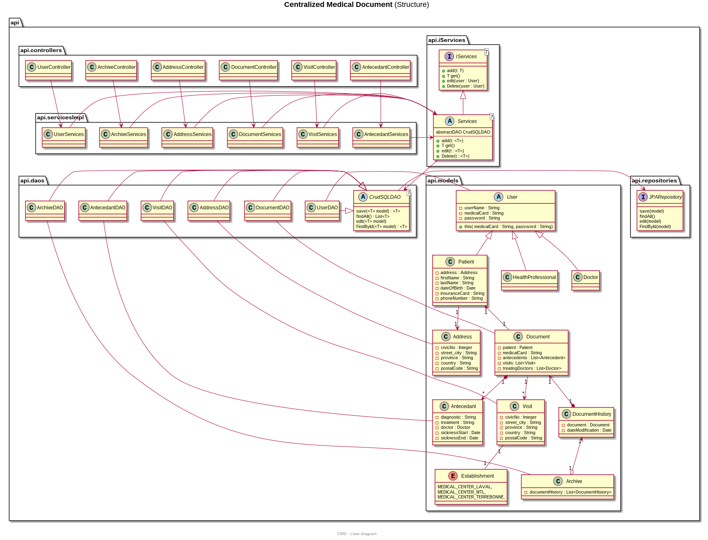

&nbsp;

&nbsp;

### Diagramme Classe Modèles

Ce diagramme démontre la relation entre les modèles et les rôles d'un utilisateur

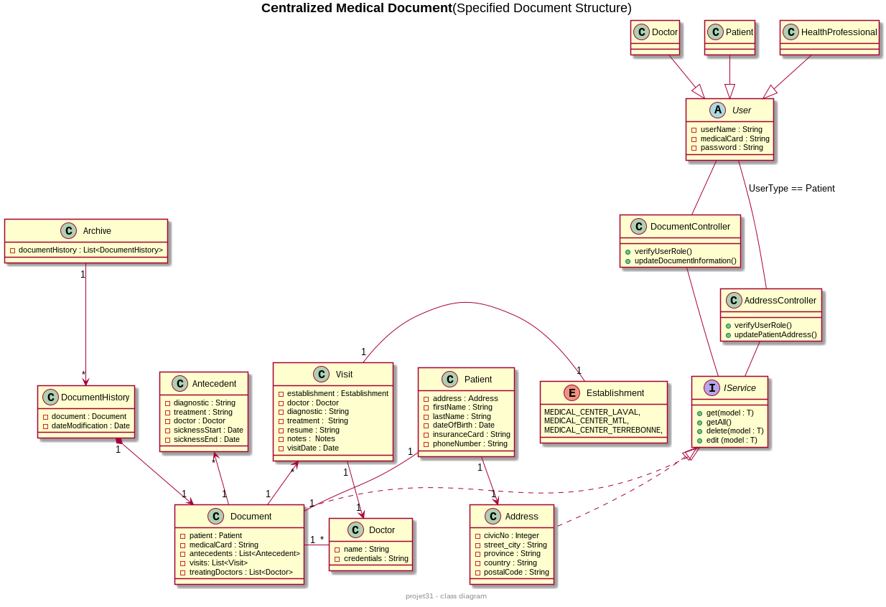

&nbsp;

&nbsp;

### Diagramme de Classe Client

Ce diagramme est basé sur la conception MVC

Afin de garder le diagramme purgé, quelques vues sont laissées de côté, mais ne changent pas le principe.

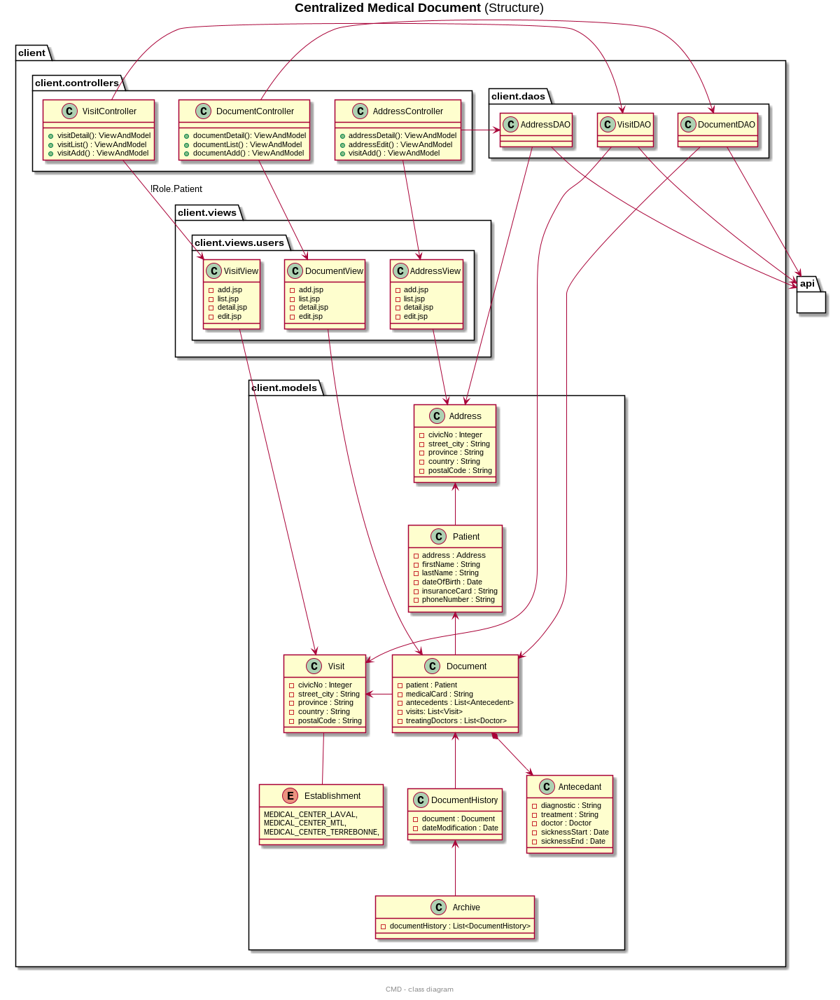

### Diagramme de User

Ce diagramme illustre l'interaction entre un client et notre api.
L'exemple est fait avec un User
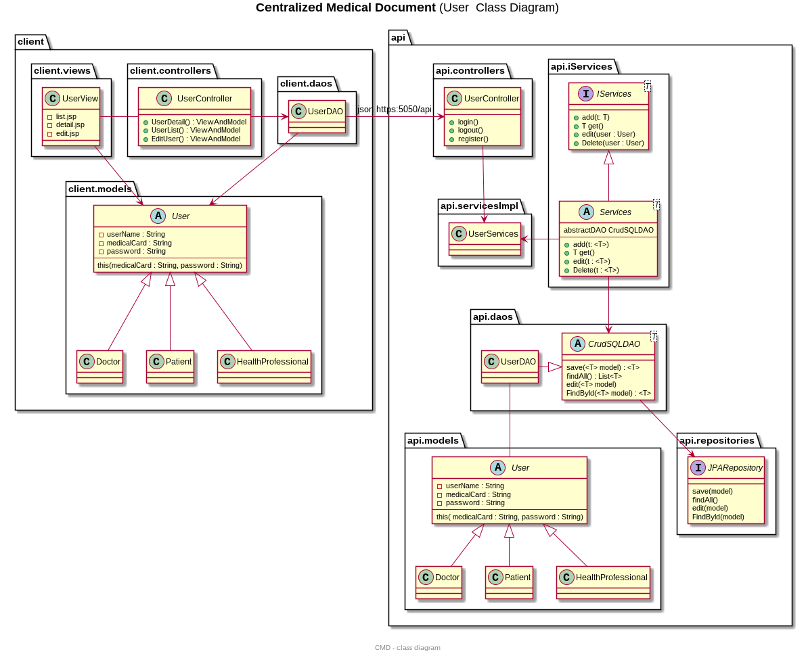
&nbsp;
&nbsp;

## Diagramme de Package

Ce diagramme illustre l'interaction entre les packages

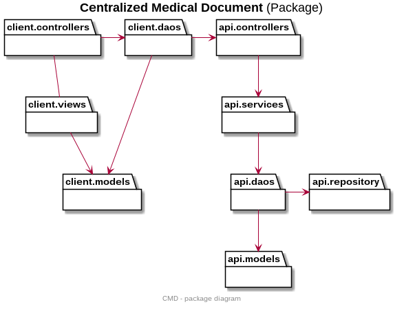
## Justification GRASP pour les diagrammes de classes

### Document

La classe Document a la responsabilité de contenir l'information des classes:
Visit, Antecedant , Patient et Doctor

Selon GRASP le Document aura la responsabilité de créateur  
puisque le Document aura la responsabilité d'enregistrer l'information de ses derniers et donc s'applique à la loi:

B "contains" or compositely aggregates A.
B records A.
B closely uses A.
B has the initializing data for A that will be passed to A when it is created. Thus B is an Expert with respect to creating A.

### Controllers

Les classes Controllers sont directement liées au pattern GRASP: Controlleur
Ils seront responsables de diriger l'information sortante et entrante d'une application client
par exemple le UserController: selon quelles informations reçues, il délèguera à un service secondaire.

### 'Abstract' CrudSQLDAO

Cette classe abstraite est directement  justifiée selon le pattern GRASP: Polymorphisme l'indirection
Afin de faciliter l'extension du logiciel, chaque nouvelle classe ayant besoin d'accès à la base de données extensionnera CrudSQLDAO.  
Les méthodes de bases de transaction seront implémentées une fois seulement fermant la modification du code ( principe ouvert fermé).

### 'Abstract' User

Cette classe abstraite est directement  justifiée selon le pattern GRASP: Polymorphisme 

Chaque nouveau rôle d'un utilisateur sera ajouté par l'extension de classe User, et différentes restrictions seront émises selon le type d'utilisateur.

### DAO classes

Ces classes sont directement  justifiées selon le pattern GRASP: l'indirection - faible couplage - forte cohésion

L'indirection:  
Un 'Data Acces Object' a comme responsabilité de communiquer directement à la base de données et séparer la partie logique de notre système  
de la partie donnée ( les objets persistants ).

Couplage faible :  
Chaque DAO s'occupera des transactions SQL de 1 table seulement vers la base donnée ainsi assurant un couplage faible entre les modules

Forte cohésion : Chaque classe dao implique une forte cohésion en fait qu'il s'occupe que d'une responsabilité. (le lien entre la base de données)

### Abstract Service

Justifiée selon le Polymorphisme, de plus la classe service est composée de la classe abstraite DAO afin d'utiliser le patron Stratégie.

### Service

La responsabilité de cette classe abstraite est justifiée selon le pattern GRASP: indirection - Couplage faible

Ceci a comme responsabilité d'être l'intermédiaire(l'indirection) entre l'accès à la base de données ( par les classes DAO's )  
et les contrôleurs. De plus, ils auront la responsabilité d'avoir une logique d'affaires.

&nbsp;
&nbsp;
## Diagramme des cas d’utilisation

Ce diagramme donne un aperçu des différents acteurs et de leurs interactions avec le système. Chaque acteur est relié d’une flèche à ses cas d’utilisations. Les deux derniers cas d’utilisation n’ont pas de lien puisqu’ils sont exécutés par le système lui-même sans implication directe d’un acteur. 
Les liens "include" signifient qu'un cas est prérequis avant qu'un autre puisse être appliqué tandis que les liens "extends" signifient qu'un cas a préalablement été réalisé avant d'être en mesure de réaliser l'autre. Nous entrons plus en profondeur dans les détails pour chacun des cas dans leur diagramme de séquence associé.

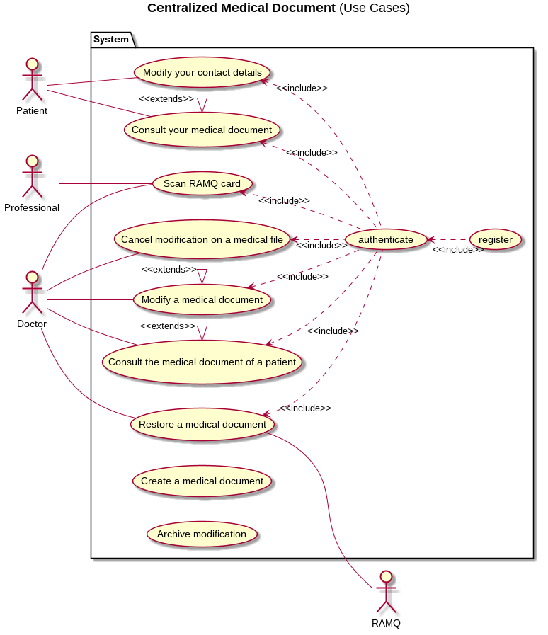
## Diagramme de séquence système

### Consultation d'un dossier médical d'un patient par un médecin
Ce diagramme illustre les évènements provoqués par le médecin lorsque celui-ci tente de consulter le dossier médical d’un patient. On parcourt les événements jusqu’à la recherche du document du patient dans la base de données pour ensuite, afficher le document en question.

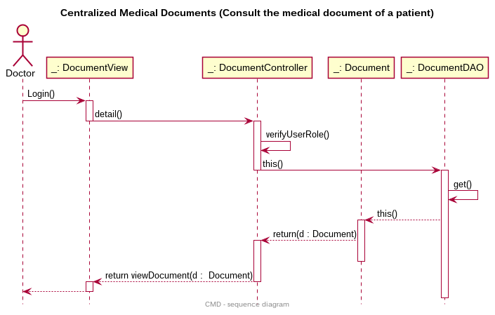
### Modification d'un dossier médical
Ce diagramme illustre les événements provoqués par le médecin lorsque celui-ci tente de modifier le dossier médical d’un patient. Du moment où le médecin clique sur le bouton pour éditer le profil jusqu’à la modification de ce document dans la base de données et de sa sauvegarde automatique des changements apportés. On retourne ensuite le document modifié jusqu’à son affichage sur le poste de travail du médecin.

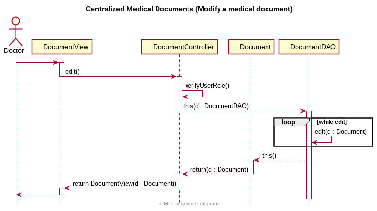
### Restauration d'un dossier médical
Ce diagramme illustre les événements provoqués par le médecin ou la RAMQ lorsqu’un d’eux tente de restaurer le dossier médical d’un patient avec un de ses dossiers médicaux archivés. Tout d’abord, on a besoin d’obtenir la liste des documents médicaux archivés du patient en question. Une fois que l’on a décidé du document à restaurer, on peut le choisir et le changement au dossier sera apporté suivi de sa sauvegarde automatique. 
Encore une fois, le document restauré sera affiché à l’écran.

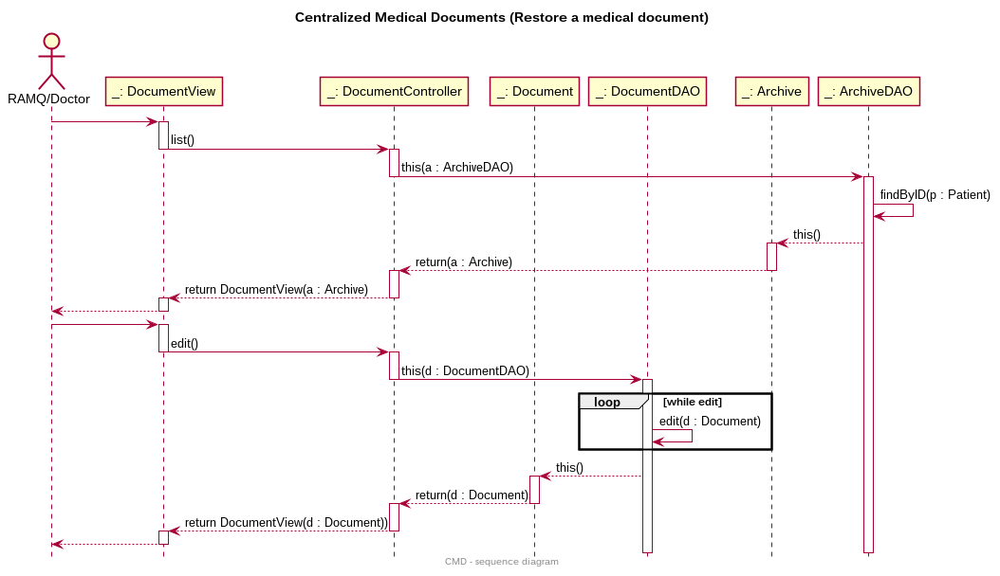
### Annulation d'une modification sur un dossier médical
Ce diagramme illustre les événements provoqués par le médecin lorsque celui-ci tente de modifier le dossier médical d’un patient puis décide d’annuler ses modifications. On a donc le même principe initial que le cas de modification de dossier médical à l’exception que le médecin décide d’annuler ses modifications apportées au dossier. La sauvegarde automatique du dossier n’est donc pas effectuée et le document affiché est celui montré initialement au début de la séquence.

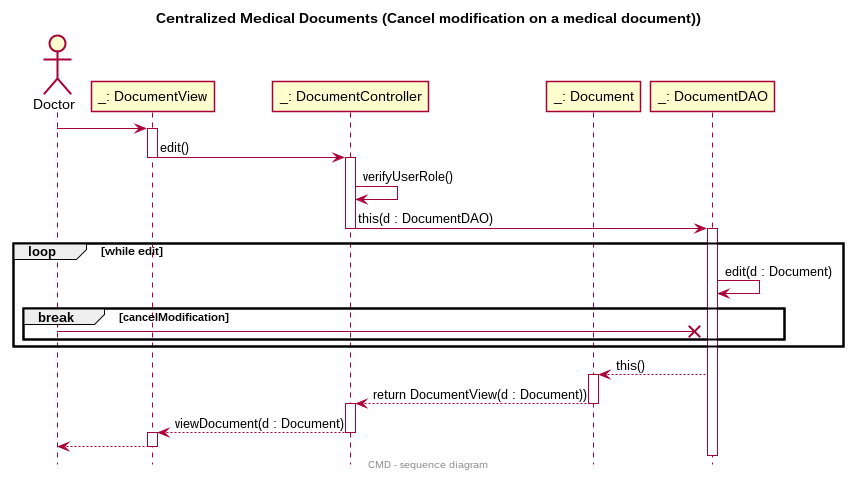
### Modification de l'archive
Ce diagramme illustre les événements lorsqu’un dossier médical est modifié et sauvegardé. Cette séquence s’effectue automatiquement par le système lorsqu’une sauvegarde de modification de dossier est faite. Lorsqu’un document est modifié, l’objet DocumentHistory associé au Document est mis à jour avec le Document modifié ainsi que la date de modification. Ce DocumentHistory est par la suite archivé dans un objet Archive qui est mis à jour dans la base de données. La modification est par la suite sauvegardée et le document modifié est retourné pour son affichage.

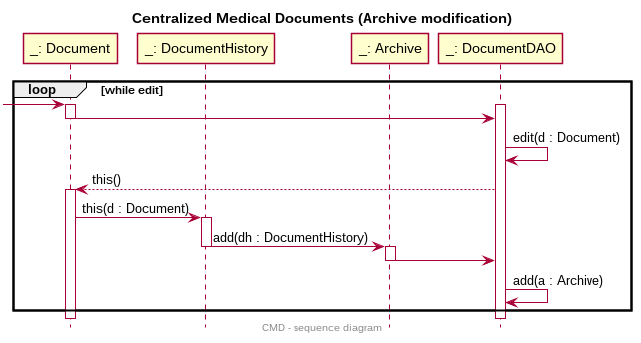

### Consultation d'un dossier par un patient
Ce diagramme de séquence illustre l'échange des différents objets lorsqu'un patient veut consulter les détails de son dossier médical. D'abord afin de simplifier le diagramme, nous avons omis les échanges de messages pour la connexion. 
Après la connexion d'un patient sur la plateforme, un message est envoyé au contrôleur de dossier afin de créer un "Data Access Object" qui lui ira communiquer avec la base de données. Avec la méthode get(), le DAO ira chercher les différentes informations du dossier dans la base de données et créera un objet Dossier. 
Ensuite l'objet Dossier est retourné au contrôleur de dossier pour créer une vue avec le dossier. Finalement la vue sera affichée à l'utilisateur.

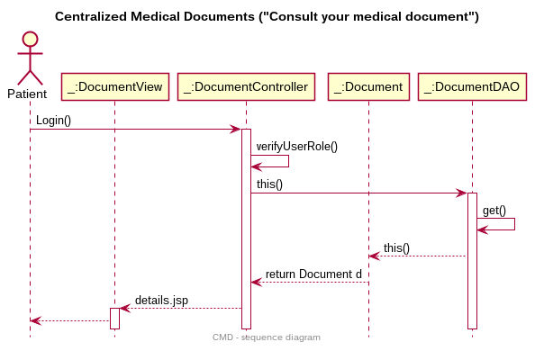

### Modification des informations de contact du dossier par un patient
Ce diagramme illustre l'échange des différents objets lorsqu'un patient veut modifier ses informations de contact à son dossier. D'abord pour simplifier le diagramme, le patient se trouve déjà sur une vue du dossier. 
Ensuite le patient clique sur un bouton pour modifier ses informations. L'action de click est envoyée à InfoController qui va créer un "Data Access Object" Info. 
Ensuite à l'aide de la méthode get(), il va aller chercher les informations de contact, créer un objet Info pour ensuite le retourner au contrôleur d'info. Le contrôleur retourne une vue avec les informations de contact.

Après être arrivé sur la vue de la modification des informations de contact. Le patient peut modifier ses informations. Lorsqu'il a terminé, il appuie sur un bouton pour sauvegarder qui envoi un message au contrôleur d'Info pour utiliser le Data Access Object qui va modifier les informations dans la base de données avec les nouvelles informations en utilisant la méthode edit().
Finalement, la base de données sauvegarde les modifications. Un nouvel objet Info est créé à partir des nouvelles informations qui sont retournées au contrôleur pour
finalement créer une nouvelle vue avec les nouvelles informations.

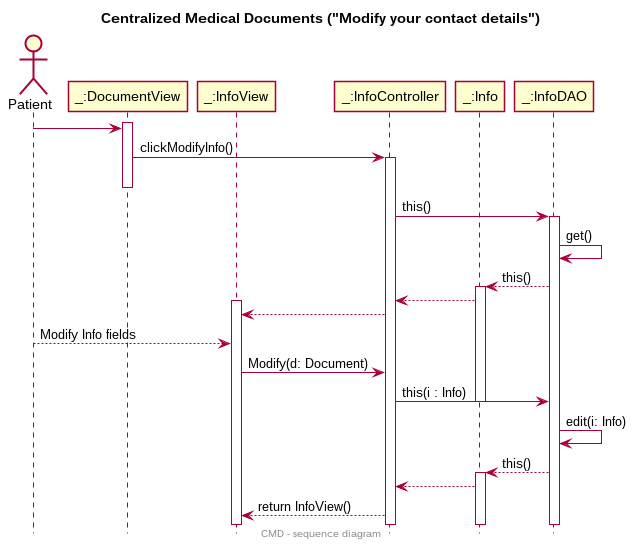

### Scan de la carte d'un patient
Ce diagramme illustre l'échange des différents objets lorsqu'un professionnel de la santé ou un docteur scanne la carte médicale d'un patient. Lorsque la carte est scannée, l'information est envoyée au contrôleur Document qui gère les transactions sur un dossier.
Ensuite celui si appelle le "Data Access Object" d'un dossier pour aller trouver les informations sur un dossier dans la base de données.
Un objet Document est ensuite créé avec les informations et il est retourné au contrôleur. Finalement le contrôleur retourne une vue avec le dossier du patient.

### Création de dossiers patients
Ce diagramme illustre l'échange des différents objets lors de la création des dossiers médicaux. D'abord à une heure précise dans la nuit tous les dossiers uniques de la RAMQ vont se télécharger du système de la RAMQ. Ensuite cette information est envoyée au contrôleur de Dossier et un objet Document est créé.
Ensuite cet objet est envoyé au "Data Access Object" Document. Les informations de l'objet sont ensuite ajoutées à la base de données de notre système avec la méthode add(). Cette exécution est faite pour chaque nouveau dossier.
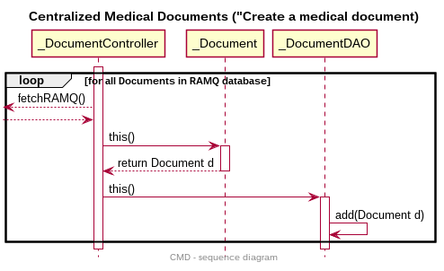

### Authentification d'un utilisateur
Ce diagramme illustre le processus d'authentification d'un utilisateur. Comme il n'est pas encore connecté, il se trouvera en premier lieu sur une vue d'authentification. Il pourra alors entrer les informations de son profil pour se connecter. Ses informations passeront alors par le contrôleur d'utilisateur puis par le DAO qui ira chercher le profil de l'utilisateur selon les informations entrées.
Si le profil n'est pas trouvé, une erreur d'authentification surviendra, sinon, l'utilisateur sera connecté à son profil.
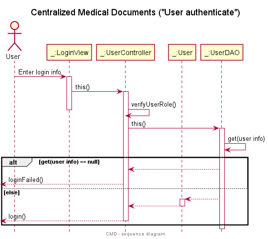

### Inscription d'un utilisateur
Ce diagramme illustre le processus de création de comptes utilisateur. Comme l'utilisateur n'a pas de compte, il se trouvera sur la vue de création de comptes. Il entrera alors les informations requises qui seront alors utilisées par le contrôleur d'utilisateur.
Ce dernier, via le DAO d'utilisateur, créera le profil utilisateur dans la base de données. Dernièrement, l'utilisateur sera redirigé vers la vue d'authentification.

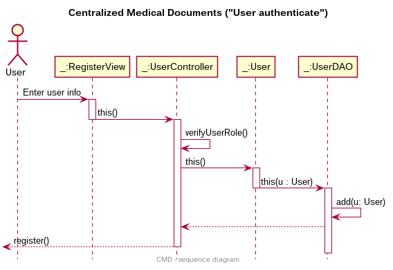

## Diagramme de composantes
Ce diagramme illustre les dépendances entre les différents
modules (englobant plusieurs classes) qui feront partie du système incluant les contrôleurs, l'API, la base de données
ainsi que l'interface utilisateur.

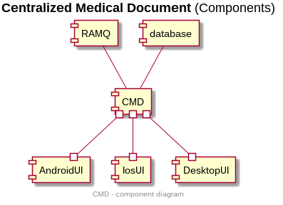

## Diagramme de déploiement
Ce diagramme illustre l'architecture physique du système en liant avec des noeuds les
parties dépendantes du système, et ce entre la partie client (les trois types d'interfaces), la partie serveur qui s'occupera de la gestion
sécuritaire des données, ainsi que l'accès à la base de données.

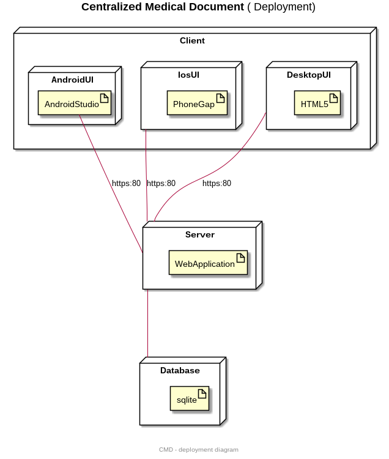