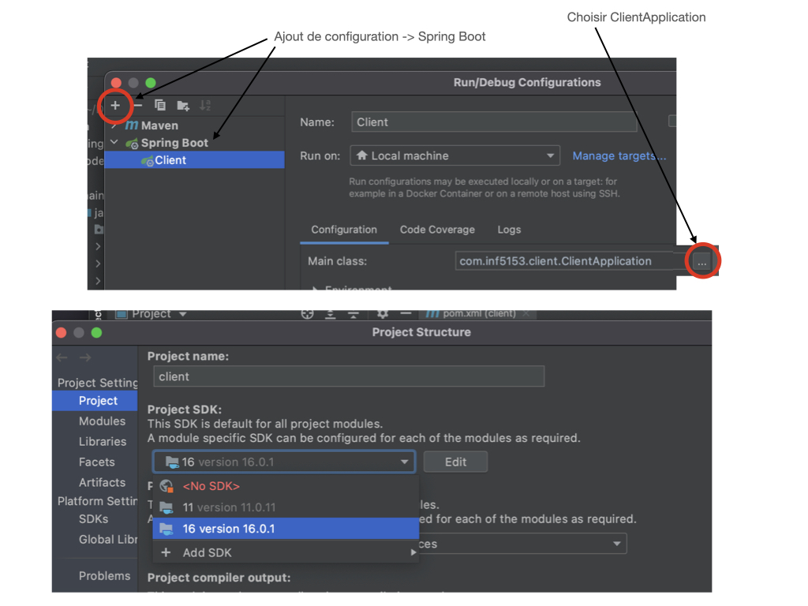

# DMC (Dossier médical centralisé)

## Description
Le projet est la conception d'un logiciel de centralisation de dossiers médicaux pour la RAMQ. Ce projet est un projet de session dans le cadre du cours INF5153-Géni Logiciel: Conception. Le but de ce projet est de conceptualiser un logiciel complet de centralisation de dossier et d'implémenter la partie de gestion de dossier par les médécins seulement afin de valider si notre conception est bonne.

---

## Auteurs
OLIVIER BOHIGAS - BOHO09069604
ALEX DUFOUR-COUTURE - DUFA23059001
JEFFREY ROBILLARD - ROBJ20039301
CYLIA TAZAIRT - TAZC29579700

---

## Video Explicative pour la Remise 
https://youtu.be/9T92jDO7vJw

## Requirements

+ Maven 3.8 (?) ou moins
+ Java-16 JDK 16
+ Intellij Ultimate

---

## Éxécution et compilation

## Lancer l'app sur Unix -  Linux/ Mac Os 

### Lancer l'application web en ligne de commande

1. avoir Maven 4.0+ installé
2. avoir le port `8888` ouvert 

À l'interieur de la racine du dossier `webapp` à partir d'un terminal cmd:

> mvn spring-boot:run 

Aller voir l'application à l'addresse:
`http://localhost:8888/`  

Si vous avez des problemes coté données, supprimer: `./api/sqllitesample.db` et redémarrer

## Lancer l'app sur Windows ( Intellij)

1. Avoir Intellij Ultimate ( Spring boot )

+ `Open` depuis un Project existant ( localiser `webapp` pom.xml locations ).

* File -> Project -> Ajouter Java 16 JDK (Voir l'image plus bas)

* En haut à Droit dans `edit Configurations` -> + -> add Confirguation Spring boot

* Main class `...` devrait selectionner automatique la classe.

---

## Script SQLite3
Il a été mentionné par l'enseignant qu'un script SQL n'était pas nécéssaire si nous utilisions un framework qui génère les tables sql tout de seul. (Voir `/webapp/src/main/java/com/inf5153/api/models/` et `/webapp/src/main/java/com/inf5153/api/SQLDialect.java`).

Le framework utilisé dans notre projet est Hibernate.

---

## Contenu
##**webapp/**

- **src/main/java/com/inf5153/api/**
    - **config/**
        - _MyAuthenticationProvider.java_: Ce fichier contient le code source pour la gestion de l'authentification.
        - _SecurityConfig.java_: Ce fichier contient les propriétés pour SpringSecurity.
    - **controllers/**
        - _AddressController.java_ : Ce fichier contient le code source pour le Contrôleur d'Address.
        - _ApplicationController.java_: Ce fichier contient le code source pour le Contrôleur de l'application.
        - _DocumentController.java_: Ce fichier contient le code source pour le Contrôleur de Document.
        - _PatientController.java_: Ce fichier contient le code source pour le Contrôleur de patient.
    - **daos/**
        - _AbstractDAO.java_: Ce fichier contient la classe abstraitre pour les Data Access Objects.
        - _AddressDAO.java_: Ce fichier contient la classe du Data Access Object d'Address.
        - _AntecedantDAO.java_: Ce fichier contient la classe du Data Access Object d'Antecedant.
        - _ContactDAO.java_: Ce fichier contient la classe du Data Access Object de Contact.
        - _DocumentDAO.java_: Ce fichier contient la classe du Data Access Object de Document.
        - _DocumentHistoryDAO.java_: Ce fichier contient la classe du Data Access Object de DocumentHistory.
        - _PatientDAO.java_: Ce fichier contient la classe du Data Access Object de Patient.
        - _RoleDAO.java_: Ce fichier contient la classe du Data Access Object de Role.
        - _UserDAO.java_: Ce fichier contient la classe du Data Access Object de User.
        - _VisitDAO.java_: Ce fichier contient la classe du Data Access Object de Visit.
    - **data/**
        - _seedDocument.java_: Ce fichier permet de générer des Documents dans la base de données.
        - _seedRole.java_: Ce fichier permet de générer des Roles dans la base de données.
        - _seedUser.java_: Ce fichier permet de générer des User dans la base de données.
    - **interfaces/**
        - _IAbstractDAO.java_: Ce fichier contient l'interface pour la classe AbstractDAO.
        - _IAbstractServices.java_: Ce fichier contient l'interface pour la classe AbstractServices.
    - **models/**
        - _Address.java_: Ce fichier contient la classe de l'objet Address.
        - _Antecedant.java_: Ce fichier contient la classe de l'objet Antecedant.
        - _Contact.java_:
        - _Document.java_: Ce fichier contient la classe de l'objet Document.
        - _DocumentHistory.java_: Ce fichier contient la classe de l'objet DocumentHistory.
        - _Gender.java_: Ce fichier contient l'enumération pour  l'attribut Gender de Patient.
        - _Institution.java_: Ce fichier contient l'enumération pour  l'attribut Institution de Visit.
        - _Patient.java_: Ce fichier contient la classe de l'objet Patient.
        - _Role.java_: Ce fichier contient la classe de l'objet Role.
        - _User.java_: Ce fichier contient la classe de l'objet User.
        - _Visit.java_: Ce fichier contient la classe de l'objet Visit.
    - **repositories/**
        - _AddressRepository.java_: Ce fichier contient la classe qui permet d'utiliser JPARepository sur l'objet Address.
        - _AntecedantRepository.java_: Ce fichier contient la classe qui permet d'utiliser JPARepository sur l'objet Antecedant.

        - _ContactRepository.java_: Ce fichier contient la classe qui permet d'utiliser JPARepository sur l'objet Contact.
        - _DocumentHistoryRepository.java_: Ce fichier contient la classe qui permet d'utiliser JPARepository sur l'objet DocumentHistory.
        - _DocumentRepository.java_: Ce fichier contient la classe qui permet d'utiliser JPARepository sur l'objet Address.
        - _PatientRepository.java_: Ce fichier contient la classe qui permet d'utiliser JPARepository sur l'objet Patient.
        - _RoleRepository.java_: Ce fichier contient la classe qui permet d'utiliser JPARepository sur l'objet Role.
        - _UserRepository.java_: Ce fichier contient la classe qui permet d'utiliser JPARepository sur l'objet User. 
        - _VisitRepository.java_: Ce fichier contient la classe qui permet d'utiliser JPARepository sur l'objet Visit.
    - **services/**
        - _AbstractService.java_: Ce fichier contient la classe abstraite qui permet d'utiliser les Services de JPARepository 
        - _AddressService.java_: Ce fichier contient la classe qui permet d'utiliser les services de JPARepository pour l'objet Address.
        - _AntecedantService.java_: Ce fichier contient la classe qui permet d'utiliser les services de JPARepository pour l'objet Antecedant.
        - _ContactService.java_: Ce fichier contient la classe qui permet d'utiliser les services de JPARepository pour l'objet Contact.
        - _DocumentHistoryService_: Ce fichier contient la classe qui permet d'utiliser les services de JPARepository pour l'objet DocumentHistory.
        - _DocumentService.java_: Ce fichier contient la classe qui permet d'utiliser les services de JPARepository pour l'objet Document.
        - _PatientService.java_: Ce fichier contient la classe qui permet d'utiliser les services de JPARepository pour l'objet Patient.
        - _RoleService.java_: Ce fichier contient la classe qui permet d'utiliser les services de JPARepository pour l'objet Role.
        - _UserService.java_: Ce fichier contient la classe qui permet d'utiliser les services de JPARepository pour l'objet User.
        - _VisitService.java_: Ce fichier contient la classe qui permet d'utiliser les services de JPARepository pour l'objet Visit.

    - _ApiApplication.java_ : Ce fichier contient la classe pour le point d'entré de l'application.
    - _SQLDialect.java_ : Ce fichier contient le code sources pour l'éxécution des différentes requêtes SQL par le framework Hibernate.

- **src/main/java/com/inf5153/ressources**
    - **/static**
        - **/css**
         - _theme.css_: Fichier de style pour le design de l'application
        - **/js**
         - _antecedantAutomaticSave.js_: Fichier javascript pour la gestion de la sauvegarde automatique d'un antecedant au dossier d'un patient.
         - _visitAutomaticSave.js_: Fichier javascript pour la gestion de la sauvegarde automatique d'une visite au dossier d'un patient.
    - **/templates**
        - **/views**
            - _addressEdit.html_: Fichier Html pour l'affichage de la vue pour éditer une addresse.
            - _addressForm.html_: Fichier Html pour l'affichage de la vue pour ajouter une addresse.
            - _addressList.html_: Fichier Html pour l'affichage de la vue l'addresse d'un patient.
            - _antecedantForm.html_: Fichier Html pour l'affichage de la vue pour éditer un antecedant.
            - _antecedants.html_: Fichier Html pour l'affichage de la vue pour visionner tous les antecedants.
            - _document.html_: Fichier Html pour l'affichage de la vue pour visionner un document.
            - _documentList.html_: Fichier Html pour l'affichage de la vue pour afficher tous les docouments.
            - _documentSearch.html_: Fichier html pour l'affichage de la vue pour la recherche d'un document.
            - _login.html_: Fichier Html pour l'affichage de la vue pour le login.
            - _visitForm.html_: Fichier Html pour l'affichage de la vue pour éditer une visite.
            - _visits.html_: Fichier Html pour l'affichage de la vue pour visionner une visite.
        - _main-layout.html_: Fichier Html pour l'affichage des éléments commun dans les vue.

- **src/test/java/com/inf5153/api/**
    - **controllers/**
        - _AddressControllerTest.java_ : Fichier de Tests unitaires pour la classe AddressController.
        - _ApplicationControllerTest.java_: Fichier de Tests unitaires pour la classe ApplicationControlleur.
        - _DocumentControllerTest.java_: Fichier de Tests unitaires pour la classe DocumentController.
        - _PatientControllerTest.java_: Fichier de Tests unitaires pour la classe PatientController.
    - **models/** 
        - _AddressTest.java_ : Fichier de Tests unitaires pour la classe Address.
        - _AntecedantTest.java_ : Fichier de Tests unitaires pour la classe Antecedant.
        - _ContactTest.java_: Fichier de Tests unitaires pour la classe Contact.
        - _DocumentHistoryTest.java_: Fichier de Tests unitaires pour la classe DocumentHistory.
        - _DocumentTest.java_ : Fichier de Tests unitaires pour la classe Document.
        - _PatientTest.java_ : Fichier de Tests unitaires pour la classe Patient.
        - _RoleTest.java_ :  Fichier de Tests unitaires pour la classe Role.
        - _UserTest.java_ : Fichier de Tests unitaires pour la classe User.
        - _VisitTest.java_ : Fichier de Tests unitaires pour la classe Visit.
    - **services/**
        - _AddressServiceTest.java_ : Fichier de Tests unitaires pour la classe AddressService.
    - _ApiApplicationTests.java_ :  Fichier de Tests unitaires pour la classe ApiApplication.
- _.idea/_ : Dossier générer par IntelliJ pour ses dépendances.
- _.mvn/_ : Dossier générer par Maven pour ses dépendances.
- _target/_ : Dossier d'éxécution de l'application.
- _pom.xml_ : Dossier de dépendances de l'application.

---

## Références
- https://getbootstrap.com pour les ressources de bootstrap.
- https://www.baeldung.com/ pour SpringBoot.

