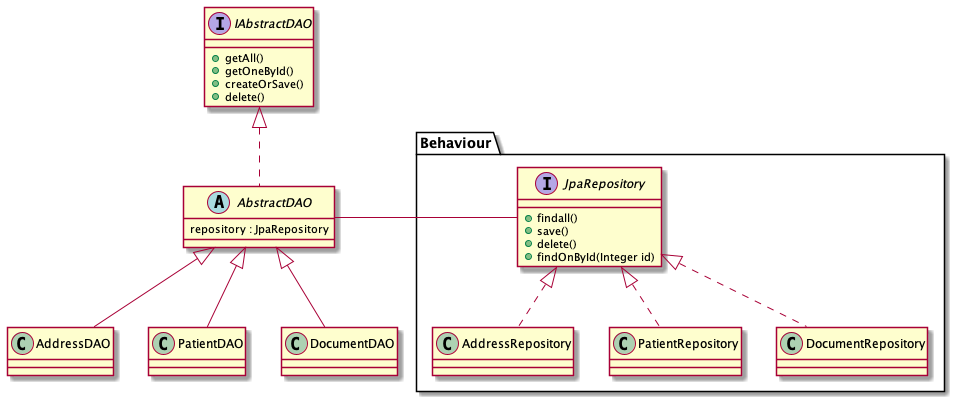

 

## UNIVERSITÉ DU QUÉBEC À MONTRÉAL 
&nbsp;
### PROJET SESSION
### TRAVAIL PRÉSENTÉ
### À GNAGNELY SERGE DOGNY
&nbsp;
## DANS LE CADRE DU COURS
## GÉNIE LOGICIEL : CONCEPTION
### INF5153
#### GROUPE 020
&nbsp;
#### PAR
#### OLIVIER BOHIGAS - BOHO09069604
#### ALEX DUFOUR-COUTURE - DUFA23059001

#### JEFFREY ROBILLARD - ROBJ20039301
#### CYLIA TAZAIRT - TAZC29579700

&nbsp;
## 15 août 2021
&nbsp;

---

# Changement de conception - 

## Changement de conception - API et client.

Afin d'alléger la charge de travail et puisque la réalisation se limite a l'application du médecin, nous avons décidé d'intégrer l'application médicale en 1 application seulement au lieu de lancer 2 applications (un API et un client). La RAMQ et autres pourront toujours accéder aux données nécessaires afin de reconstruire un dossier puisqu’un point d'entrée sera fourni. Le diagramme `classe_diagramme`  mit à jour intègre la conception de l'api et les vues du client, mais ne change pas l'interaction globale entre les modèles des classes. En somme rien n'a été retiré, mais au lieu elles sont adaptées ou combinées.

Nous avons tout d'abord ajouté une vue d'authentification `LoginView` qui permet à l'utilisateur de se connecter via son profil d'utilisateur. Cette authentification passe par un contrôleur `AuthentificationProvider` qui utilise les `UserServices`.

Nous avons aussi ajouté les modèles DAO manquant pour nos modèles. Il y a donc eu l'ajout de `PatientDAO` `RoleDAO` et `ContactDAO`. 
    
Un changement plus important maintenant est le changement de la classe `User`. Cette classe n'est désormais plus abstraite. Nous avons donc décidé d'ajouter une classe `Role` qui elle permettra de modéliser le rôle de l'utilisateur.

De plus, afin de retirer des responsabilités à certaines classes déjà assez complètes et afin de rendre notre conception encore plus évolutive, nous avons créé deux énumérations.

La première est l'`Enum` `Gender`. Pour l'instant, seulement 3 valeurs s'y trouvent, mais cette classe pourrait être amenée à évoluer dans le temps afin de rendre notre application plus inclusive et donc il sera extrêmement facile d'y apporter des modifications.

La deuxième est l'`Enum` `Institution` qui regroupe toutes les institutions de notre système. Cela permet de facilement d'ajouter, de modifier ou de retirer des institutions de notre système, mais aussi de contrôler l'étendu de ce type de données. 

Le dernier ajout a été l'ajout de la classe `Contact`. Cela nous permet d'encapsuler davantage nos classes et regrouper les attributs communs et leurs méthodes en classe plus spécialisées.
    
Finalement, certaines classes ont vu leurs attributs être modifiés puisque nous voulions spécialiser nos classes davantage et retirer des responsabilités à certaines classes qui devenaient trop génériques. Les modèles principalement modifiés sont Patient, Address, Document et Visit.

---

# Diagrammes de Patron

### Introduction

Nous avons choisi des diagrammes de patrons déjà établis et implémentés par le cadriciel Spring et SpringBoot,  
les patrons incluent: Proxy, Singleton, Factory et Stratégie. 

 

## _Factory_

Factory est présent par défaut avec Spring, chaque demande d'une class `model` , Spring créer donc une Bean associer  
La création des `beans` est faite par l'entremise d'une factory.

`Cas d'utilisation typique`:  
Un objet demande accès a une classe modèle, l'application Spring utilisera donc la factory afin de créer la `bean` demander. 

## Proxy

Le cadriciel Spring fournit également par défaut un patron `Proxy`, en effet, un service transactionnel ou accès à objet de transfert ne se fait pas directement par le vrai service, un objet `proxy` est créé et c'est ce dernier qui utilise le `vrai` service

`Cas Typqiue séquence:`  
Un contrôleur de chemin demande un service sur une base de données,
Un objet proxy est soit  
 1. créer si celui-ci n'existe pas , ou   
 2. retourner si celui-ci existe

## Singleton

Spring fourni le patron `Singleton`, donc l'utilisons d'un service ( access a la base de donee ) sera donc transactionnel et aucune concurrence n’entre le même sera possible.  
Si la classe n'existe pas , elle est donc instanciée et retournée.  
Si la classe existe , elle est retournée.  
__Une seule instance peut exister a tout moment__  

`Cas typique séquence`:  
Spring fourni également ce service : La demande d'un service est plutôt la demande d'une instance de ce service. Si le service n'est pas créé il est a la classe de s'initier.

## Stratégie

Ce patron n'était pas fourni par Spring, l'implémentions du patron comportementale stratégie a pour but de répondre aux différents besoins de la classe abstrait DAO. Un DAO contient un comportement(`interface repository`), concrétisé par différentes classes dépendant de leurs spécialisations ( a l'implémentation `AddressDAO` le comportement `repository` sera concrétisé par `addressRepository`).

`Cas typique séquence :`  

Durant l'implémentation de la classe AddressDAO, le choix du comportement `Repository` sera choisi par l'entremise de la classe AbstractDAO. 

