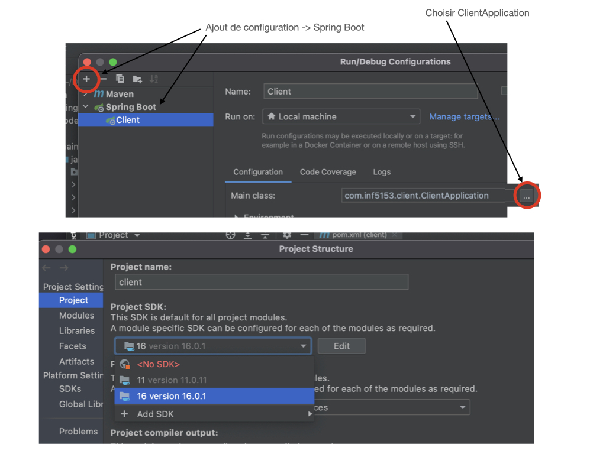

## Dependencies
+ Maven 3.8 (?) ou moins
+ Java-16 JDK 16
+ Intellij Ultimate

## Launching app on Unix -  Linux/ Mac Os 

### Launching the Client app

1. Have Maven 4.0+ installed 
2. have ports '8888' open. 

Inside  root  folder of `webapp` (pom.xml location) terminal cmd: 

> mvn spring-boot:run 

See application on a web browser address:

`http://localhost:8888/`  

If any problems occur data-wise delete : ./api/sqllitesample.db and restart `webapp` container.

## Launching app on Windows ( Intellij)

1. Have Intellij Ultimate ( Spring boot )

+ `Open` from existing Project ( locate `webapp` pom.xml locations ).

* File -> Project -> add Java 16 JDK (see image below)

* top right in `edit Configurations` -> + -> add Confirguation Spring boot

* Main class `...` should select automatically the class

